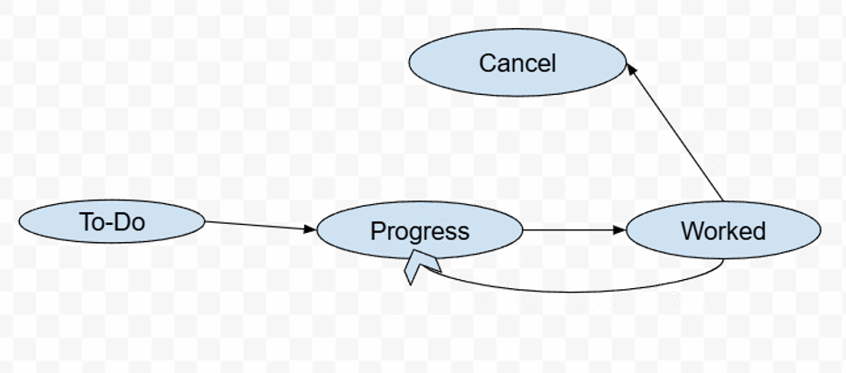

# Security Hub Visibility

  

## A GitHub Action that syncs Security Hub findings with Jira issues

  

1. Gets all current findings from Security Hub, filtered by the `Severity` of the findings (default is `CRITICAL,HIGH,MEDIUM`)

  

2. Creates Jira issues for findings that do not already have a Jira issue

  

-  **To avoid duplicate issues**, the search criteria use default settings for three primary label identifiers: region label, AWS account ID label, and a label "security-hub" along with any custom label configurations provided (see jira-labels-config for example). Additionally, a comparison of the Jira issue description and finding title is made against the findings list. If there is a title match, the decision is based on the Resources list. 

***Note that modifications or deletions of labels may lead to duplicate issue creation***

- For example, if a Jira ticket T1 already exists for a finding with title T1, and a new finding appears with the same title T1 but a different Resources list, the implementation treats these as distinct, resulting in two tickets with the same title but different resources. 

3. Closes existing Jira issues in the target project if their associated findings are no longer active. For findings with the same title, closure is determined based on the resources’ presence. For example, if there are two tickets for finding T2 with different resources, `r1` and `r2`, and `r1` is no longer present, then only the T2 ticket with `r1` will be closed

## Tickets Consolidation
If ticket consolidation is enabled (refer to JIRA_CONSOLIDATE_TICKETS in the input section), a single ticket will be created for findings with the same title but different resources in each run. For example, if two findings titled "T2" are reported in a single run, the resources will be merged, and a single ticket will be created for both findings.

In the next run, if one or more findings under the title "T2" are reported again, these new findings will not be merged with the previous "T2" tickets. Instead, a new ticket will be created for the new "T2" findings, and the resources from this new run will be merged into it.

The closure of consolidated tickets depends on the resolution of all the resources listed in their description. For instance, if we have two "T2" tickets with resource lists [r1, r2] and [r3, r4], the first ticket will remain open until all resources are resolved (i.e., no longer present). If r1 and r3 are resolved, neither of the "T2" tickets will be closed. However, if r2 is also resolved, the first ticket will be closed.
## Tenable Recognition
If Tenable findings are reported under the "Default" product name, this implementation will identify the findings based on the product fields and treat them as if they are under the product name "Tenable."

## Outputs

The action provides the following outputs:

- **updates**: List of URLs of created issues.
- **total**: Count of updates made during the run.
- **created**: Count of newly created issues.
- **closed**: Count of issues closed during the run.
- **create-issue-errors**: Count of errors encountered during Jira issue creation.
- **link-issue-errors-on-creation** (v2.2.1): Count of errors encountered during Jira issue linking at creation time.
- **link-issue-errors-on-closure** (v2.2.1): Count of errors encountered during Jira issue linking at closure time.
- **jql**: The JQL query used for retrieving new updates.

You can utilize the outputs to extend the security hub functionalities. This is especially useful for real-time updates on your security findings and issue tracking.

For example, You can refer to this [Slack Alert Example](https://github.com/Enterprise-CMCS/mac-fc-security-hub-visibility/blob/v2/.github/workflows/test.yml) for a working implementation of Slack notifications in your Security Hub integration workflow.

## Inputs

  

Inputs can either be provided by GitHub Action YAML, Please see `action.yml` or if being run locally via environment variables. In GitHub Action YAML files, input variables are lowercase and separated by dashes." For example, the environment variable `JIRA_BASE_URI` would be `jira-base-uri` if set in a GitHub Action YAML file.

 

### JIRA_BASE_URI

  

**Required: No**

  

**Default Value: https://jiraent.cms.gov**

  

Specifies the base URI prepended to all API calls.

  

### JIRA_USERNAME

  

**Required: Yes**

  

**Default Value: N/A**

  

Jira Username used to authenticate.

  

### JIRA_TOKEN

  

**Required: Yes**

  

**Default Value: N/A**

  

Jira Personal Access Token used to authenticate.

  

### JIRA_PROJECT

  

**Required: Yes**

  

**Default Value: N/A**

  

The Jira Project in which Security Hub tickets should be created in by this tool.

  

### JIRA_IGNORE_STATUSES

  

**Required: No**

  

**Default Value: 'Done, Closed, Resolved'**

  

Specifies the Jira issue statuses to omit when refreshing Security Hub Jira issues.

  

### JIRA_ASSIGNEE

  

**Required: No**

  

**Default Value: N/A**

  

Assignee to be used for any ticket created by this tool.

  

### JIRA_CUSTOM_FIELDS

  

**Required: No**

  

**Default Value: N/A**

  

JSON string of Jira custom field keys/values, e.g. `{ "customfield_14117": "example-value" }`

  

### JIRA_API_VERSION

  

**Required: No**

  

**Default Value: 3**

  

Specifies which Jira API version to use for communication with Jira. This affects both the API endpoints and the data formats used for descriptions and comments.

- **v3**: Uses modern Atlassian Document Format (ADF) for rich text descriptions and comments. Recommended for Atlassian Cloud instances.
- **v2**: Uses plain text format with Jira markup for descriptions and comments. Required for older Enterprise Jira instances that don't support ADF.

**Example usage in GitHub Actions:**
```yaml
- uses: your-action
  with:
    jira-api-version: '2'  # Use v2 for Enterprise Jira
    # ... other inputs
```

  

### AWS_SEVERITIES

  

**Required: No**

  

**Default Value: 'CRITICAL,HIGH,MEDIUM'**

  

Comma separated list of AWS Security Hub finding severities for which this tool should create Jira Issues.

  

### AWS_REGION

  

**Required: No**

  

**Default Value: us-east-1**

  

AWS Region to target

  

### SECURITY_HUB_NEW_ISSUE_DELAY

  

**Required: No**

  

**Default Value: 86400000**

  

Delay in milliseconds for filtering out ephemeral issues. The default value of 86400000 is 24 hours.

  

### AUTO_CLOSE

  

**Required: No**

  

**Default Value: true**

  

If set to true, when a Security Hub finding is resolved, the corresponding Jira issue will be closed. If set to false, the description will be updated and a comment will be added indicating the finding has been resolved, but the Jira Issue status will not change. The closure has following modes

  

**Full Transition Handling**

The **Full Transition Handling** feature operates automatically when the `jira-transition-map` is not specified. It helps manage issue resolution by automatically transitioning issues through the workflow towards a final status.

  

### How It Works

  

-  **Automatic Transitioning**: The feature attempts to move the issue to one of the commonly used closing statuses, which are:

  

-  `done`

-  `closed`

-  `close`

-  `complete`

-  `completed`

-  `deploy`

-  `deployed`

  

-  **Stopping Point**: If the workflow does not include any of these closing statuses, the system will transition the issue to the final status in the workflow that is not a reject status.

-  **Reject Statuses**: The system avoids transitioning to statuses that indicate rejection or cancellation, such as:

  

-  `canceled`

-  `backout`

-  `rejected`

-  `cancel`

-  `reject`

-  `block`

-  `blocked`

  

For example If there's a workflow which has following transition rules


  

In this example:

  

- If an issue is at the `To-Do` status, the feature will attempt to transition through `Progress` and `Worked`.

- Since `Worked` is the last status before the end of the workflow and does not fall into the reject categories, the transition handling will stop there.

  

This feature ensures that issues are moved efficiently through the workflow towards a completion state, minimizing the need for manual intervention.

**Note**: `If the full transition handling feature does not stop at the desired status, consider specifying the transition map using jira-transition-map variable`

  

### JIRA_TRANSITION_MAP

  

When the `AUTO_CLOSE` feature is enabled, the `TRANSITION_MAP` defines which transitions to execute for statuses that are not terminal. Terminal statuses are those where no further action is needed (often 'Done' or similar).

  

### Overview

  

-  **Purpose**: Automate issue transitions based on the specified path to the closure transition.

-  **Format**: A string of semi-colon separated `status:transition` pairs, where each pair maps a status to its transition.

-  **Case Insensitive**: Statuses and transitions are not case-sensitive

  

### Example

  

Let' say there is a jira workflow with the following transition rules.

**Jira Workflow:**

  

`[In Progress] --To QA--> [In QA] --To Test--> [In Test] -- Complete --> [Done]`

  

_Note: [In Progress] is status of issue and the QA is transition name_

  

**Transition Map:**

`"In Progress:To QA, In QA:To Test, In Test:Complete"`

  

- The map provides transitions for statuses except 'Done', which is terminal.

- The system will follow the map's transitions until it reaches a terminal status or detects a loop.

  

**Guide to Specify Transition Map**

To get jira workflow transition information

  

1.  **View Transition Details**:

  

- Open an issue in Jira and click on the status dropdown menu to see the list of available transitions.

  


  

2.  **Define Transition Rules**:

  

- Suppose the current status is "In Progress" with possible transitions to "Validate," "Block," and "Cancel." If you want to automate moving to "Validate," add this rule to your transition map:

`In Progress: Validate`

- To continue the issue's progress through the workflow, include the next transition. For instance, if "Validate" leads to "In Review" and you want to set up a transition to "Approve," use:

`In Progress: Validate; In review: Approve`

  

3.  **Update the Transition Map**:

  

- Add all relevant `status:transition` pairs to ensure the issue moves through the desired states according to your workflow.

  

### Wild Card Transition Support

  

If your Jira workflow allows transitions from many or all statuses to another status (such as "Done"), you can use the `*` wildcard in the transition map to specify this. For example, if your Jira workflow permits transitions from any status to "Done," your transition map should be:

  

```

* : Done

```

  

The wildcard has priority in this integration. This means that when processing transitions, the system will first apply any wildcard rules before considering other specific transitions. So, if you have a wildcard transition and other defined transitions in your map, the wildcard transition will be executed first, and then the system will proceed with the other transitions according to the rules defined.

  

### DRY_RUN

  

**Required: No**

  

**Default Value: false**

  

Execute a sync but only log API calls to Jira which would create/modify Jira Issues.

  

### `jira-link-id-on-creation` (v2.2.1)

  

**Required: No**

  

**Default Value: None**

  

**Description:** This field specifies the Jira link ID to which the newly created issue will be linked. If a value is provided, the issue will be associated with this link ID. If not specified, the issue will remain unlinked.

  

### `jira-link-type-on-creation` (v2.2.1)

  

**Required: No**

  

**Default Value: 'Relates'**

  

**Description:** Defines the type of relationship between the new issue and the feature issue specified by the `jira-link-id-on-creation`. The default relationship is 'Relates'. Other types can be used depending on your Jira configuration, such as 'Blocks', 'Is blocked by', or 'Duplicates'.

  

### `include-all-products`

  

**Required: No**

  

**Default Value: false**

  

**Description:** A boolean flag that determines whether findings from all products should be included in the sync process. When set to true, the tool will include findings from other products beyond those specified. When false, only findings from the specified products will be processed.

  

### `skip-products`

  

**Required: No**

  

**Default Value: None**

  

**Description:** A comma-separated list of product names for which findings should be excluded from the sync. This allows you to omit specific products from the synchronization process.

  

### `jira-link-direction-on-creation` (v2.2.1)

  

**Required: No**

  

**Default Value: None**

  

**Description:** Specifies the direction of the issue link in Jira, which can be either 'inward' or 'outward'. 'Inward' means the new issue will be linked to the feature issue, while 'outward' means the feature issue will be linked to the new issue.

### `jira-link-id-on-closure` (v2.2.1)

  

**Required: No**

  

**Default Value: None**

  

**Description:** This field specifies the Jira link ID to which the closed issue will be linked. If a value is provided, the issue will be associated with this link ID. If not specified, the issue will remain unlinked.

  

### `jira-link-type-on-closure` (v2.2.1)

  

**Required: No**

  

**Default Value: 'Relates'**

  

**Description:** Defines the type of relationship between the closed issue and the linking issue specified by the `jira-link-id-on-closure`. The default relationship is 'Relates'. Other types can be used depending on your Jira configuration, such as 'Blocks', 'Is blocked by', or 'Duplicates'.

### `jira-link-direction-on-closure` (v2.2.1)

  

**Required: No**

  

**Default Value: None**

  

**Description:** Specifies the direction of the issue link in Jira, which can be either 'inward' or 'outward'. 'Inward' means the closed issue will be linked to the linking issue, while 'outward' means the linking issue will be linked to the closed issue.

### `jira-labels-config`

  

**Required: No**

  

**Default Value: None**

  

**Description:** Specifies a stringified configuration for labels to be applied to the Jira issue. Labels are used to categorize and tag issues, making them easier to search and filter.

Example: `jira-labels-config:` `"[{\"labelField\":\"ProductName\",\"labelPrefix\":\"product\",\"labelDelimiter\":\":\"},{\"labelField\":\"severity\"},{\"labelField\":\"accountId\",\"labelDelimiter\":\":\",\"labelPrefix\":\"account\"},{\"labelField\":\"region\"}]"`

Result of the custom labeling above the labels on the issues created will be: "product:Tenable" "High" "account:abc123" "us-east-1"

## CVE Label Handling Behavior (v2.2.2)

If the **CVE** field is specified in the labels configuration, the automation applies special handling to avoid errors caused by label length limits.

### Behavior

- If the **CVE** field contains **multiple CVE entries**, the system assigns a **`multi-cve`** label.  
  The individual CVE IDs can be found in the issue description.

- If the **CVE** field contains **a single CVE entry**, that CVE ID is added directly as a label.

### Purpose

This approach prevents errors that may occur when label values exceed the allowed length.

### `jira-watchers`

  

**Required: No**

  

**Default Value: ''**

  

**Description:** Comma separated list of User Emails for Atlassion Jira or User EUA IDs for Enterprise Jira.

  

### `jira-add-labels`

  

**Required: No**

  

**Default Value: ''**

  

**Description:** Comma separated list of Labels to be added on newly created issues.


## `jira-consolidate-tickets`

**Required: No**

  

**Default Value: false**

**Description:** a boolean (true/false) to enable/disable the ticket consolidation per run
  

## `test-findings-data`

**Required: No**  

**Default Value: ''**

**Description:** JSON string of raw findings list to test security hub jira sync

## Local Testing

See test-infrastructure/jira-container/README.md for instructions on how to run against local Jira container


## Due Date Automation

Automatically assigns a due date to newly created Jira issues based on the severity of the Security Hub finding.

When a Jira issue is created, the system checks for a severity label (CRITICAL, HIGH, MODERATE, or LOW) and calculates the due date by adding a configurable number of days to the current date. 
The resulting date is formatted as YYYY-MM-DD and added to the duedate field.

**Default Due Dates by Severity**

You can customize these defaults via GitHub Action inputs or environment variables.

| Severity   | Input Name           | Default (Days) |
|------------|----------------------|----------------|
| Critical   | `due-date-critical`  | 15             |
| High       | `due-date-high`      | 30             |
| Moderate   | `due-date-moderate`  | 90             |
| Low        | `due-date-low`       | 365            |

**Configuring the Due Date Field**

By default, the due date is set in the standard Jira `duedate` field. However, you can specify a different field (e.g., a custom field) using the `jira-duedate-field` input.

| Input Name           | Default Value | Description                                                                 |
|----------------------|---------------|-----------------------------------------------------------------------------|
| `business-duedate` | `duedate`     | The Jira field ID to use for setting the due date (e.g., `customfield_xxxxx`). |

** Examples of GitHub Action inputs: **
-  due-date-critical: 3
-  due-date-high:     6
-  due-date-moderate:   9
-  due-date-low:      12

## How to Find a Custom Field ID in Jira

1. Access Jira Administration
 Ensure you're logged in as a Jira Admin.
 - Go to: Jira Settings → Issues → Custom Fields
2. Locate the Custom Field
 - Use the search bar to find the field you're interested in.
3. Open Field Details
 - Click the three-dot menu next to the field and select Edit Details.
4. Find the Field ID
 - You'll be redirected to a new URL. The custom field ID will appear in the URL, formatted like this:

   `id=<field_id>`
   
 - The field name will be:  customfield_<field_id>

This logic now attempts to fetch due dates from the CISA Known Exploited Vulnerabilities (KEV) feed when a CVE ID is present.
If found, it uses the CISA due date.
If no CISA due date is found, it falls back to our severity-based default due dates.


## Contributing

### How to Modify Code and Create a Pull Request

If you want to contribute changes to this project, follow these steps:

1. **Make your changes**: Edit the code as needed in your local branch.

2. **Build the project**: After making changes, you must rebuild the distribution files:
   ```bash
   pnpm install
   pnpm build
   ```

3. **Important**: **Do NOT use `npm install`**. Using `npm install` instead of `pnpm install` may result in the failure of the `check-dist` action in CI/CD. This project uses `pnpm` as its package manager, and using `npm` will create an incompatible `package-lock.json` file.

4. **Commit your changes**: Once the build is successful, commit your changes including the updated distribution files.

5. **Create a Pull Request**: Push your branch and open a PR for review.

Version 2.1.2 : This update intentionally causes the job to fail when the Jira 2,000 issue-linking limit is reached or when issue creation/linking fails, validating proper error handling and logging.
