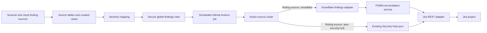

# Snowflake Global Security Findings to Jira Integration Discovery

**Status:** Draft for architecture and security review  
**Date:** August 26, 2026  
**Repository:** <code>mac-fc-security-hub-visibility</code>  
**Proposed integration:** <code>BUS_CMCS.PRIVATE.VW_GLOBAL_SECURITY_FINDINGS</code> to Jira through a scheduled GitHub Action

## 1. Executive summary

The proposed integration reads normalized, open security findings from a Snowflake secure view and creates or closes Jira tasks for one authoritative FISMA boundary. The preferred approach is to extend the existing Security Hub-to-Jira action with a second source mode rather than build a separate ticketing client. This preserves one Jira authentication, retry, API-version, issue-creation, and workflow-transition implementation.

A local proof of concept is present in this working tree. It demonstrates:

- source selection between AWS Security Hub and Snowflake;
- Snowflake key-pair or password authentication;
- an authoritative query for every open finding in exactly one FISMA system;
- one Jira issue per stable global-finding identity;
- duplicate prevention through hashed Jira labels;
- fixed <code>snowflake-findings</code> provenance plus canonical FISMA ownership labels so manual and other-system tickets are excluded;
- a row ceiling that aborts reconciliation when the result might be truncated; and
- dry-run behavior plus unit tests for query safety and identity stability.

This is not evidence of a deployed integration. No live Snowflake connection, Snowflake grant, Jira project permission, scheduled workflow, ticket creation, or closure has been verified from this repository. Before a write-enabled pilot, the team must resolve the compatibility gaps in Section 10 and complete the staged validation in Section 12.

## 2. Evidence classification

This document uses four evidence classes so proposed behavior is not confused with deployed behavior.

| Evidence class                    | Meaning in this document                                                                                                    |
| --------------------------------- | --------------------------------------------------------------------------------------------------------------------------- |
| Repository verified               | Directly supported by the current local source, action metadata, example workflow, generated bundle, or tests               |
| User-provided environment context | Snowflake objects or operational facts described for this discovery but not independently queried from the target account   |
| Platform documented               | Supported by current official Snowflake, GitHub, or Atlassian documentation                                                 |
| Pilot validation required         | Depends on the target Snowflake account, Jira instance, networking, credentials, workflow configuration, or production data |

## 3. Problem statement

Security findings are normalized in Snowflake, but remediation work is managed in Jira. Without a controlled integration, teams must manually transfer finding details, duplicate detection is inconsistent, and resolved findings can leave stale Jira tickets.

The integration must:

1. select only findings owned by the intended FISMA system;
2. map each source finding to a stable Jira identity;
3. avoid duplicate tickets across repeated schedules;
4. avoid closing tickets because of a partial or failed source query;
5. work with the target Jira REST API and workflow;
6. keep Snowflake and Jira credentials out of source control;
7. provide an auditable dry-run and rollout path; and
8. preserve the existing AWS Security Hub mode.

## 4. Goals and non-goals

### Goals

- Use <code>VW_GLOBAL_SECURITY_FINDINGS</code> as the normalized consumption contract.
- Reconcile exactly one FISMA ID or acronym per workflow across all tools and severities.
- Create one Jira task for each stable finding identity.
- Make scheduled runs idempotent.
- Default Snowflake auto-close to disabled.
- Reuse the existing Jira API adapter and its retry behavior.
- Support Jira REST API v2 and v3 formatting.
- Make result truncation, authentication failure, and query failure fail closed before Jira reconciliation.

### Non-goals for the first pilot

- Replacing Snowflake ingestion, streams, tasks, or source-specific lifecycle procedures.
- Writing status changes from Jira back to Snowflake.
- Consolidating unrelated findings into one Jira ticket.
- Automatically assigning findings to teams without an approved ownership mapping.
- Proving production readiness through local unit tests alone.

## 5. Current and proposed architecture

The user-provided Snowflake design unifies Trivy, Dockle, Kube-bench, SonarQube, Snyk, Wiz, and AWS Security Hub findings and normalizes their severities. The action consumes only the secure view; it does not manage those upstream ingestion resources.



Repository evidence:

- [Action source routing](../src/index.ts) selects <code>aws-security-hub</code> or <code>snowflake</code>.
- [Snowflake adapter](../src/libs/snowflake-lib.ts) validates configuration, builds the query, maps rows, and destroys the connection.
- [Global reconciliation service](../src/global-findings-jira-sync.ts) owns identity, labels, create, and close decisions.
- [Shared Jira adapter](../src/libs/jira-lib.ts) performs search, issue creation, comments, transitions, retries, and v2/v3 formatting.
- [Action contract](../action.yml) exposes the GitHub Action inputs.
- [Example workflow](../examples/snowflake-view-sync.yml) is intentionally outside <code>.github/workflows</code>, so it does not schedule a live job.

## 6. Snowflake consumption contract

### 6.1 Required view columns

The action expects the following columns:

| Column                           | Use                                                          |
| -------------------------------- | ------------------------------------------------------------ |
| <code>FISMA_ID</code>            | Required ownership boundary and part of finding identity     |
| <code>FISMA_ACRONYM</code>       | Alternate ownership filter and Jira label                    |
| <code>RESOURCE_ID</code>         | Affected resource and part of finding identity               |
| <code>FINDING_ID</code>          | Source finding identifier and part of finding identity       |
| <code>TOOL_NAME</code>           | Ticket title prefix, label, and identity component           |
| <code>STATUS</code>              | Only <code>OPEN</code> rows are selected                     |
| <code>SEVERITY</code>            | Original source severity shown in the ticket                 |
| <code>NORMALIZED_SEVERITY</code> | Jira priority mapping and label                              |
| <code>SEVERITY_SCORE</code>      | Query ordering                                               |
| <code>CREATED_AT</code>          | Ticket context and deterministic query ordering              |
| <code>CLOSED_AT</code>           | Mapped into the typed finding but not used by the open query |
| <code>FINDING_AGE</code>         | Ticket context                                               |
| <code>RAW_FINDING</code>         | Source title, description, and remediation candidates        |

The consumer converts <code>RAW_FINDING</code> to JSON in Snowflake and reads only selected title, description, and remediation keys when composing a Jira issue. The team must still confirm that those fields are approved for the target Jira project's audience.

### 6.2 Query safeguards

The current proof of concept:

- validates database, schema, and view names as unquoted one-to-three-part Snowflake identifiers;
- binds filter values instead of interpolating them;
- refuses a query unless exactly one FISMA ID or acronym is supplied;
- filters to every <code>OPEN</code> row for that FISMA boundary across all tools and severities;
- keeps the newest row per tool, FISMA ID, resource ID, and finding ID;
- requests <code>maxRows + 1</code> rows and aborts before Jira mutation if the ceiling is exceeded; and
- closes the Snowflake connection in a <code>finally</code> block.

### 6.3 Required Snowflake access

Use a dedicated service user and role. The exact names require team approval, but the role needs only warehouse usage, container usage, and view select:

```sql
GRANT USAGE ON WAREHOUSE TEAM_CMCS_WH
  TO ROLE MACFC_JIRA_SYNC_ROLE;
GRANT USAGE ON DATABASE BUS_CMCS
  TO ROLE MACFC_JIRA_SYNC_ROLE;
GRANT USAGE ON SCHEMA BUS_CMCS.PRIVATE
  TO ROLE MACFC_JIRA_SYNC_ROLE;
GRANT SELECT ON VIEW BUS_CMCS.PRIVATE.VW_GLOBAL_SECURITY_FINDINGS
  TO ROLE MACFC_JIRA_SYNC_ROLE;
```

Snowflake documents key-pair authentication for the Node.js driver with <code>SNOWFLAKE_JWT</code>, <code>privateKey</code>, and <code>privateKeyPass</code>. Snowflake also documents the warehouse, database, schema, and object privileges used above. Live grants and the user's public key assignment remain pilot checks.

## 7. Jira identity and lifecycle

### 7.1 Stable identity

The proposed identity is:

<code>TOOL_NAME | FISMA_ID | RESOURCE_ID | FINDING_ID</code>

The action hashes this value into a Jira label beginning with <code>global-finding-</code>. This avoids putting long or invalid source identifiers directly into labels. The hash is truncated, so the practical collision risk is low but not mathematically zero.

Every managed issue also receives:

- <code>global-security-findings</code>;
- <code>snowflake-findings</code> to prove integration provenance;
- canonical <code>fisma-id-&lt;value&gt;</code> and <code>fisma-acronym-&lt;value&gt;</code> ownership labels;
- a tool label;
- a normalized severity label; and
- the hashed finding identity label.

Duplicate prevention depends on the managed, Snowflake provenance, FISMA ownership, and identity labels remaining on the Jira issue. Project automation and users must not delete or rewrite them.

### 7.2 Snowflake provenance and FISMA ownership

The action does not use a configuration-derived reconciliation scope. Every Snowflake-created issue receives the fixed <code>snowflake-findings</code> label, while the configured single FISMA ID or acronym determines the ownership label used by the Jira search.

Only Jira issues in the configured project that contain all of the following are reconciled:

- <code>global-security-findings</code>;
- <code>snowflake-findings</code>;
- the exact <code>fisma-id-&lt;value&gt;</code> or <code>fisma-acronym-&lt;value&gt;</code> label requested by the run; and
- a status not excluded by <code>jira-ignore-statuses</code>.

This boundary excludes manual issues, issues created by other systems, and Snowflake issues owned by another FISMA workflow. Finding identity remains <code>TOOL_NAME | FISMA_ID | RESOURCE_ID | FINDING_ID</code> and is unchanged by this ownership model.

No reconciliation-scope label has been deployed, so this design correction requires no Jira migration or label backfill. The local proof of concept removes <code>snowflake-scope-\*</code> before the first write-enabled pilot.

### 7.3 Create behavior

For each open finding without an existing identity label, the action creates a Jira Task with:

- a 255-character source-aware summary;
- source and normalized severity;
- FISMA and resource identifiers;
- source description and remediation when present;
- acceptance criteria tied to the row no longer being open;
- managed, Snowflake provenance, FISMA ownership, and identity labels;
- mapped Jira priority; and
- configured custom fields.

The shared Jira adapter also applies the configured assignee and watchers.

### 7.4 Close behavior

For a managed Jira issue whose identity is absent from the current open finding set:

- <code>auto-close: false</code> logs the skipped closure and leaves the ticket open;
- <code>auto-close: true</code> invokes the configured Jira transition behavior and adds a source-resolution comment.

Snowflake mode defaults auto-close to false. It must remain false until the pilot proves that every expected tool produced a complete authoritative result and that a missing row means resolution rather than a partial scan, view failure, permissions drift, or source-specific lifecycle anomaly. Ordinary ingestion delay should leave persistent prior rows stale; false disappearance requires an incomplete snapshot or upstream lifecycle error and must be tested separately.

### 7.5 Reopen behavior

The current search excludes Jira statuses configured in <code>jira-ignore-statuses</code>. If a finding is auto-closed and later reopens, the closed ticket will not be returned by the managed search, so the current implementation creates a new Jira issue. The team must explicitly approve this behavior or implement ticket reopening.

## 8. GitHub Actions implementation

### 8.1 Workflow shape

The first workflow should be manually dispatched and associated with a protected non-production GitHub environment. After the dry run and controlled write pilot, add a schedule and a concurrency group to prevent overlapping reconciliation runs.

Recommended controls:

- <code>permissions: contents: read</code>;
- a reviewed, full-length immutable commit SHA for the action;
- environment-scoped Snowflake and Jira secrets;
- required reviewers for the write-enabled environment;
- one concurrency group per Jira project and FISMA boundary;
- <code>cancel-in-progress: false</code> so a newer run cannot interrupt a reconciliation already mutating Jira; and
- a self-hosted runner if Snowflake or Jira network policies do not allow GitHub-hosted runner egress.

GitHub documents that full-length commit SHAs are the immutable way to pin an action and that environments can gate jobs and limit secret access.

### 8.2 Required inputs

| Category             | Inputs                                                                               |
| -------------------- | ------------------------------------------------------------------------------------ |
| Source               | <code>finding-source: snowflake</code>                                               |
| Jira                 | base URI, username, token, project key, API version                                  |
| Snowflake connection | account, username, authenticator, warehouse, optional role, database, schema, view   |
| Snowflake credential | private key and optional passphrase for JWT, or password for password authentication |
| Finding boundary     | exactly one FISMA ID or acronym; all open tools and severities are queried           |
| Lifecycle            | max rows, dry run, auto-close, Jira transition map                                   |

### 8.3 Jira API selection

The action supports API v2 and v3 endpoints. Jira Cloud v3 uses Atlassian Document Format for description and comment fields; the shared adapter converts strings to ADF. The Enterprise Jira instance must be tested to determine whether API v2 is required. The example workflow currently selects v2, while the action default is v3.

## 9. Failure behavior

| Failure                                   | Expected behavior                                                                                                          |
| ----------------------------------------- | -------------------------------------------------------------------------------------------------------------------------- |
| Missing required input                    | Action fails before connecting                                                                                             |
| Invalid Snowflake object name             | Action fails before query construction                                                                                     |
| Missing or multiple FISMA boundaries      | Action refuses the global-view query                                                                                       |
| Snowflake authentication or query failure | Action fails; no reconciliation is attempted                                                                               |
| Result exceeds maximum rows               | Action fails before Jira create or close                                                                                   |
| Jira search failure                       | Action fails before reconciliation                                                                                         |
| Jira create failure                       | Current Snowflake reconciliation stops at the failed create; an ambiguous network retry can still risk a duplicate         |
| Jira close or comment failure             | Legacy close helpers can log and swallow some transition failures; harden and verify final status before reporting closure |
| GitHub schedule overlap                   | Not yet controlled in the example; add concurrency before scheduling                                                       |

The workflow must alert on failures without echoing secrets or raw credential material.

## 10. Prototype gaps and decisions required

These are discovery findings, not evidence that the integration is production ready.

### P0: Resolve before a write-enabled pilot

1. **Due-date severity mismatch.** Snowflake issues receive labels such as <code>severity-high</code>, but the shared Jira due-date logic looks for exact labels such as <code>HIGH</code>. Snowflake tickets therefore fall through to the moderate/default due date. Add an exact severity label or set the due date explicitly, then test all severity mappings.
2. **Action outputs are not populated in Snowflake mode.** The Snowflake reconciler logs updates and returns <code>void</code>; the existing <code>updates</code>, <code>total</code>, <code>created</code>, <code>closed</code>, error-count, and JQL outputs are populated only in AWS mode. Define one result contract and set outputs for both sources.
3. **Auto-close completeness gate.** Define how each expected tool proves a successful complete snapshot for the FISMA system. Auto-close must not rely only on a successful query returning zero rows.
4. **Jira API and workflow compatibility.** Confirm v2 or v3, authentication format, create-screen fields, Task issue type, priority names, transition names, watcher behavior, and required permissions in a non-production project.
5. **Sensitive-data review.** Approve which <code>RAW_FINDING</code>, resource, FISMA, and remediation values may be copied into Jira.
6. **Concurrency control.** Add a workflow concurrency group before enabling a schedule.
7. **Verified closure outcome.** The shared Jira close path catches some workflow errors internally. Snowflake reconciliation can therefore continue to add a resolution comment and report a closure without proving that Jira reached an approved terminal status. Return and verify the final status before recording a successful close.
8. **Ambiguous POST retry and duplicate risk.** The shared retry policy retries network failures, including an issue-create POST when no response is available. The server might have created the issue before the connection failed. Add an idempotency check or operation-specific retry policy before enabling writes.

### P1: Resolve before production rollout

1. **Reopen policy.** Choose between a new ticket and reopening the previous ticket.
2. **Update policy.** Existing tickets are not updated when severity, title, description, remediation, or resource context changes.
3. **Feature-parity policy.** Snowflake mode does not currently apply the legacy Security Hub-specific extra-label or issue-linking configuration. Decide which shared Jira behaviors must be source-neutral.
4. **Observability.** Add structured counts for selected, created, unchanged, closed, skipped, and failed findings without logging raw sensitive payloads.
5. **Partial progress.** Decide whether one Jira mutation failure should stop the whole run or be accumulated and reported after processing the remaining findings.
6. **Security Hub passed controls.** Decide at the Snowflake view layer whether passing compliance controls are always excluded from the ticketable population.
7. **Ownership mapping.** Define who owns each FISMA/tool combination and whether that maps to project, component, assignee, or custom fields.

## 11. Implementation plan

### Phase 1: Approve contracts

1. Confirm the secure view name and required columns in the target Snowflake account.
2. Record the authoritative status semantics for every selected tool.
3. Approve the stable identity and one-ticket-per-finding model.
4. Choose the Jira project, issue type, API version, priority mapping, close transition, reopen policy, and required custom fields.
5. Choose the initial authoritative FISMA ID or acronym and record the expected tool inventory and completeness contract.

**Exit criteria:** schema, lifecycle, ownership, and Jira decisions are documented and approved.

### Phase 2: Provision least-privilege identities

1. Create the Snowflake service role and user.
2. Grant warehouse, database, schema, and secure-view access only.
3. Configure and test key-pair authentication and rotation.
4. Create a Jira service identity with only browse, create, comment, transition, watcher, and required field permissions for the pilot project.
5. Store credentials in a protected GitHub environment.
6. Confirm runner network access to both services.

**Exit criteria:** both identities can perform their required read-only preflight operations under the actual runtime roles.

### Phase 3: Complete and harden the action

1. Preserve the source router and existing AWS behavior.
2. Keep the bound single-FISMA filter, all-open-findings contract, row-limit guard, and connection cleanup.
3. Resolve all P0 gaps in Section 10.
4. Add reconciliation tests covering create, unchanged, close-disabled, close-enabled, duplicate labels, pagination, API v2, API v3, Jira failures, and over-limit aborts.
5. Add a test proving a failed or incomplete Snowflake read performs no Jira mutations.
6. Build and commit the generated <code>dist</code> artifacts.
7. Make the repository lint baseline explicit; the current local lint run reports pre-existing errors in legacy Jira and Security Hub code.

**Exit criteria:** type checking, unit tests, contract tests, YAML validation, lint policy, and deterministic bundle checks pass under CI.

### Phase 4: Read-only and dry-run pilot

1. Run the exact Snowflake query under the service role and record counts by FISMA, tool, severity, and status.
2. Compare sampled view rows to the source system.
3. Run the action with dry run enabled and auto-close disabled.
4. Review proposed Jira summaries, fields, labels, priorities, due dates, and descriptions.
5. Repeat the same run and confirm identical identities and no unexpected duplicate plan.
6. Test empty, over-limit, permission-denied, and stale-source scenarios.

**Exit criteria:** reviewers approve the selected population and proposed ticket content; no Jira mutation has occurred.

### Phase 5: Controlled write pilot

1. Pin the reviewed action commit by full SHA.
2. Enable writes for one non-production FISMA boundary.
3. Create tickets and verify all fields, labels, watchers, permissions, and due dates.
4. Run again and prove idempotency.
5. Resolve one source finding and first verify closure with auto-close disabled.
6. Enable auto-close only after all expected tools prove completeness, then verify the expected Jira transition and comment.
7. Reopen the finding and verify the approved reopen policy.

**Exit criteria:** create, repeat, close, failure, and reopen evidence is captured from Snowflake, GitHub Actions, and Jira.

### Phase 6: Production rollout

1. Require environment approval for the first production runs.
2. Add a non-overlapping schedule and concurrency control.
3. Start with one production FISMA workflow and add other FISMA systems independently.
4. Publish the runbook, ownership, alert route, secret-rotation procedure, and rollback process.
5. Review Snowflake query history, GitHub run history, Jira audit evidence, duplicate rate, and failure rate after each expansion.

**Exit criteria:** operations accepts ownership and monitoring, and all production evidence is retained.

## 12. Validation and acceptance criteria

### Repository validation already completed locally

- TypeScript compilation passed.
- Nine Snowflake identity, FISMA ownership, and query-safety tests passed.
- The action metadata and example workflow parsed as YAML.
- The generated action bundle rebuilt deterministically.

These checks validate local code properties only. They do not validate a live account, view, grant, credential, Jira workflow, or ticket.

### Required automated acceptance tests

- invalid object names are rejected;
- exactly one FISMA ID or acronym is mandatory;
- all query values are bound;
- the row ceiling aborts without Jira writes;
- identity remains stable across repeated runs;
- a resource or finding identity change produces a different identity;
- one existing identity produces no duplicate;
- auto-close false performs no transitions;
- auto-close true transitions only tickets carrying the Snowflake provenance and exact FISMA ownership labels;
- v2 uses plain text and v3 uses ADF;
- due date and priority match every normalized severity;
- Snowflake and Jira errors return a failed action;
- Snowflake outputs match AWS-mode output names and meanings; and
- a clean build produces no <code>dist</code> diff.

### Required live pilot evidence

- <code>CURRENT_USER()</code>, <code>CURRENT_ROLE()</code>, and warehouse from the runtime connection;
- <code>SHOW GRANTS</code> evidence for the service role;
- sampled query results and expected counts;
- GitHub environment protection and secret names, without secret values;
- action run URL and pinned action SHA;
- Jira API version and service-account permissions;
- created issue keys and field screenshots or API responses;
- second-run idempotency;
- controlled closure and comment;
- failure alert delivery; and
- rollback execution.

## 13. Operations and rollback

### Operational monitoring

At minimum, each run should record:

- immutable action revision;
- authoritative FISMA boundary and Snowflake provenance label;
- Snowflake query ID;
- selected finding count;
- created, unchanged, closed, skipped, and failed counts;
- Jira issue keys changed;
- duration and final status; and
- whether the run was dry-run or write-enabled.

Do not log private keys, passwords, tokens, authorization headers, or full raw findings.

### Rollback

1. Disable the scheduled workflow or environment approval.
2. Set <code>auto-close</code> to false.
3. Revert to the previously reviewed action SHA.
4. Leave existing Jira tickets intact unless the ticket owner approves cleanup.
5. Revoke or rotate credentials if compromise is suspected.
6. Use the managed, <code>snowflake-findings</code>, FISMA ownership, and identity labels to identify pilot-created tickets.
7. Reconcile Snowflake and Jira evidence before re-enabling the workflow.

## 14. Definition of done

The integration is complete only when:

- the architecture and data contract are approved;
- the Snowflake role and Jira identity are least privilege;
- all P0 gaps are resolved;
- CI passes the agreed type, test, lint, YAML, and bundle gates;
- a dry run is reviewed;
- a controlled Jira create and repeat run prove idempotency;
- a controlled close and reopen follow the approved lifecycle;
- outputs and failure alerts are usable by workflow consumers;
- concurrency and source-freshness protections are active;
- operations owns the runbook and credential rotation; and
- production execution evidence is captured.

## 15. References

### Repository evidence

- [Action entry point](../src/index.ts)
- [Snowflake adapter](../src/libs/snowflake-lib.ts)
- [Global findings reconciliation](../src/global-findings-jira-sync.ts)
- [Jira adapter](../src/libs/jira-lib.ts)
- [Action inputs and outputs](../action.yml)
- [Example Snowflake workflow](../examples/snowflake-view-sync.yml)
- [Snowflake unit tests](../src/tests/snowflake-lib.test.ts)
- [Identity unit tests](../src/tests/global-findings-jira-sync.test.ts)

### Official platform documentation

- [Snowflake Node.js driver authentication](https://docs.snowflake.com/en/developer-guide/node-js/nodejs-driver-authenticate)
- [Snowflake key-pair authentication and rotation](https://docs.snowflake.com/en/user-guide/key-pair-auth)
- [Snowflake access-control configuration](https://docs.snowflake.com/en/user-guide/security-access-control-configure)
- [GitHub Actions secure-use reference](https://docs.github.com/en/actions/reference/security/secure-use)
- [GitHub Actions secrets](https://docs.github.com/en/actions/concepts/security/secrets)
- [GitHub deployment environments](https://docs.github.com/en/actions/concepts/workflows-and-actions/deployment-environments)
- [Jira Cloud REST API v3 issue search](https://developer.atlassian.com/cloud/jira/platform/rest/v3/api-group-issue-search/)
- [Jira Cloud REST API v3 issue creation and transitions](https://developer.atlassian.com/cloud/jira/platform/rest/v3/api-group-issues/)
- [Jira Cloud REST API v2 issues](https://developer.atlassian.com/cloud/jira/platform/rest/v2/api-group-issues/)
